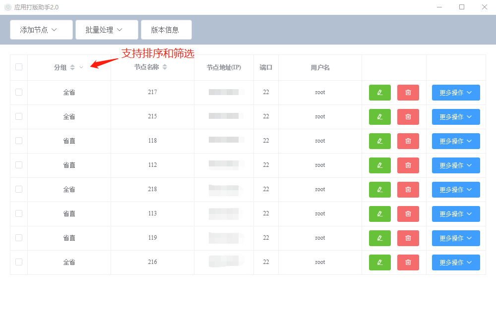
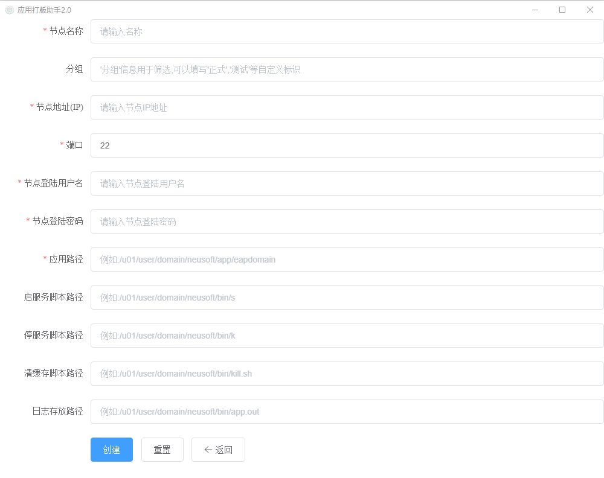
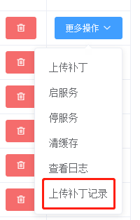
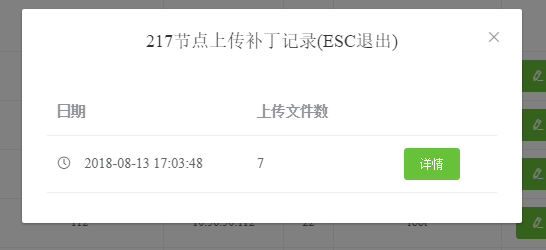
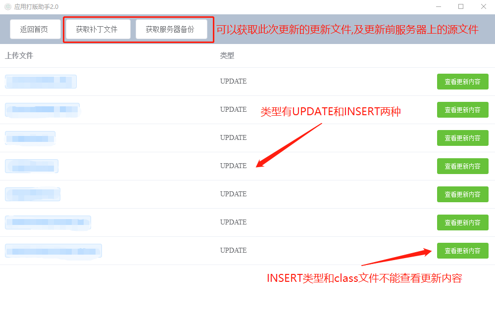
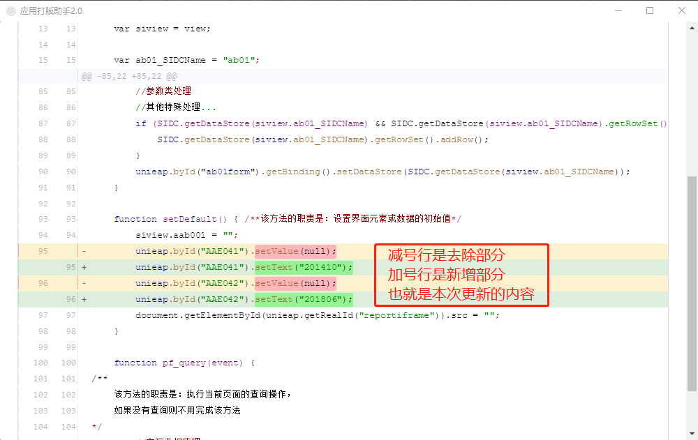
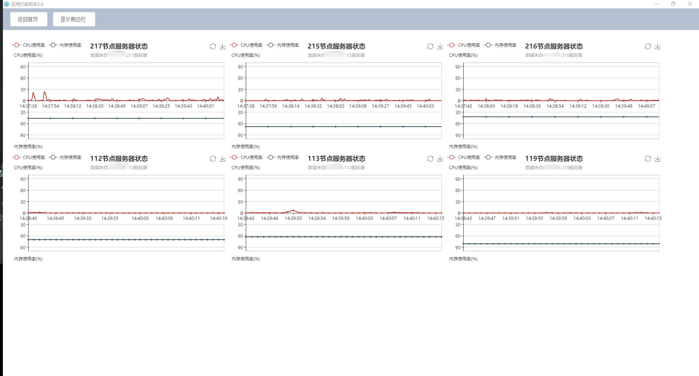

# PlayVersion

> 这是一个SSH远程连接Linux,批量上传文件,执行脚本的小工具

---

## 背景

日常工作中,码完代码之后,更新程序,需要分别往多个服务器上上传补丁文件,并逐一执行脚本,十分费时费力,开发此程序可以批量上传文件,批量执行脚本

---

## 技术栈: 
> [Electron](https://electronjs.org/) 

    Electron 基于 Chromium 和 Node.js, 让你可以使用 HTML, CSS 和 JavaScript 构建跨平台桌面应用

> [Node](http://nodejs.cn/)

    Node.js 是一个基于 Chrome V8 引擎的 JavaScript 运行环境。

> [Electron-Vue](https://simulatedgreg.gitbooks.io/electron-vue/content/cn/getting_started.html)

    Electron-Vue顾名思义,是Electron与Vue结合的一个脚手架工具,能够快速的构建初始化应用

> [Vue](https://cn.vuejs.org/)

    这个不多介绍了,国人开发的主流前端开发框架

> [Element-UI](element-cn.eleme.io/#/zh-CN)

    Vue的UI框架

> [NeDB](https://github.com/louischatriot/nedb)

    NeDB是使用Nodejs实现的一个NoSQL嵌入式数据库操作模块,可以充当内存数据库,也可以用来实现本地存储,甚至可以在浏览器中使用

> [Node-SSH](https://www.npmjs.com/package/node-ssh)

    Node使用SSH连接Linux组件

> [vue-code-diff](https://github.com/ddchef/vue-code-diff)

    文本比对插件
    
> [iconv-lite](https://www.npmjs.com/package/iconv-lite)

    使Node支持GBK编码,解决中文乱码问题

> [echarts](http://echarts.baidu.com/index.html)

    百度推出的图表库
---

## 下载使用

``` bash
# 1.将工程clone到本地
$ git clone https://github.com/IT-Unicorn/PlayVersion.git

# 2.安装工程依赖
$ npm install

# 3.运行测试程序
$ npm run dev

#----------------------------------------------

# 打包正式程序

$ npm run build

# 打包之后会在build文件路径下生成安装文件


```

---
## 功能说明

1. 主界面,可对维护好的服务器进行上传文件,执行脚本等操作

    

2. 添加/维护 服务器节点信息

    

3. 记录上传补丁记录,并能查看文件差异

    
    
    
    

4. 可以实时监控服务器的CPU及内存使用情况

    


